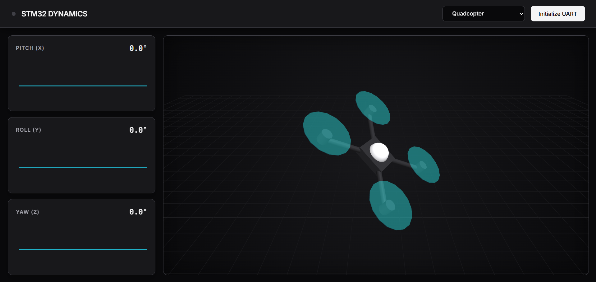
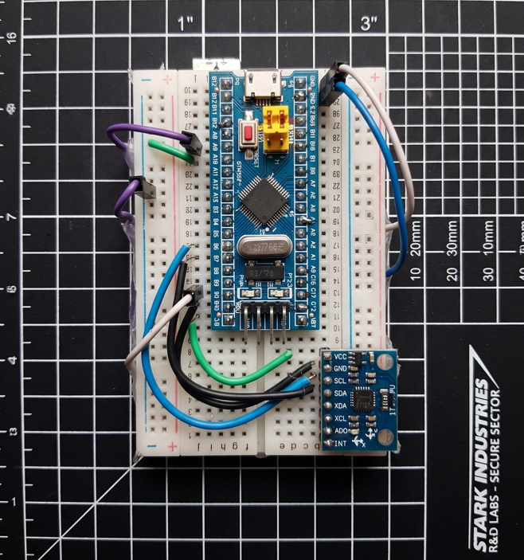

  <h1>🚀 STM32 Zero-Latency Telemetry & Sensor Fusion</h1>
  
A high-performance, browser-based 3D telemetry dashboard and flight controller prototype.

  
  <!-- The width="800" keeps the dashboard screenshot perfectly sized and centered -->
  
    

## 📌 Overview
This project demonstrates raw I2C sensor reading, mathematical sensor fusion, and direct hardware-to-browser communication. By utilizing the modern **Web Serial API**, the custom dashboard renders procedural 3D models and fluid graphs in real-time without the need for a Python or Node.js backend.

## 🛠️ The Hardware "Hack"

  <!-- The width="400" makes the hardware photo half-size so it doesn't take up the whole screen -->
  

Due to a strict deadline and missing UART bridge hardware, this project utilizes a custom hardware bypass:
* An **Arduino Uno** is put into a comatose state (`RESET` tied to `GND`).
* The **STM32 Blue Pill** hijacks the Arduino's onboard USB-to-Serial TTL chip.
* This allows the ARM Cortex-M3 processor to stream fused sensor data at 115200 baud directly to the PC.

## ⚙️ Core Features
* **Bare-Metal Math:** A Complementary Filter runs directly on the STM32, blending Gyroscope and Accelerometer data to eliminate jitter and drift.
* **Euler Angle Wrap:** Custom shortest-path algorithms prevent gimbal-lock snapping.
* **Web Serial API:** Native USB COM port reading directly in Chrome/Edge.
* **Procedural 3D:** Generates Quadcopter, Satellite, and Rocket models on the fly using Three.js.

## 🔌 Wiring Guide

| Component | STM32 Pin | Arduino Bridge Pin |
| :--- | :--- | :--- |
| **MPU6050 SCL** | PB6 | - |
| **MPU6050 SDA** | PB7 | - |
| **UART TX** | PA9 | Arduino TX (Pin 1) |
| **UART RX** | PA10 | Arduino RX (Pin 0) |

> ⚠️ **Note:** The Arduino `RESET` pin must be jumpered to `GND`, and the STM32 must share a `GND` line with the Arduino.

## 🚀 How to Run
1. Flash the `firmware.ino` to your STM32F103C8T6 using an ST-Link V2.
2. Wire the hardware as shown in the guide above.
3. Open the `index.html` file in a Chromium-based browser (Chrome/Edge), or visit the Live GitHub Pages Link.
4. Select your 3D model, click **Initialize UART**, and select your USB COM port!

## 📌 Overview
This project demonstrates raw I2C sensor reading, mathematical sensor fusion, and direct hardware-to-browser communication. By utilizing the modern **Web Serial API**, the custom dashboard renders procedural 3D models and fluid graphs in real-time without the need for a Python or Node.js backend.

📖 **Read the detailed Report of Errors here** [The Development Journey & Bug Log](Report.md)
